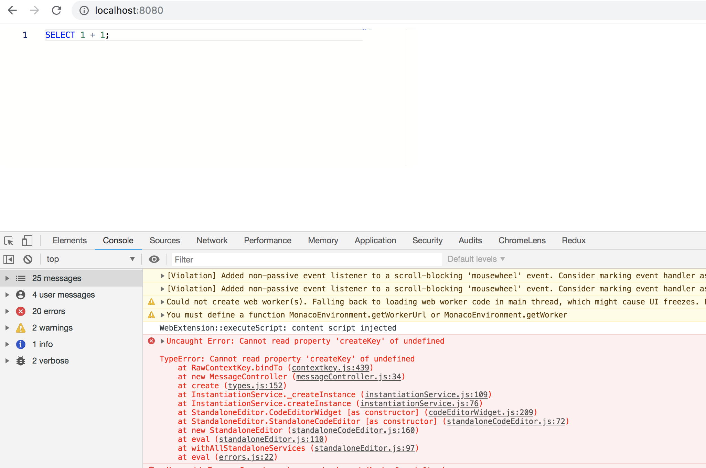

# buildoptimizer-error

See https://github.com/angular/angular-cli/issues/14033

This repository demonstrates a bug present in `@angular-devkit/build-optimizer@0.9.0-beta.0` and later.

When using `@angular-devkit/build-optimizer` with `monaco-editor`, a number of uncaught runtime exceptions are thrown.

## Reproduction

```
npm install
npm start
```

Then go to http://0.0.0.0:8080/


